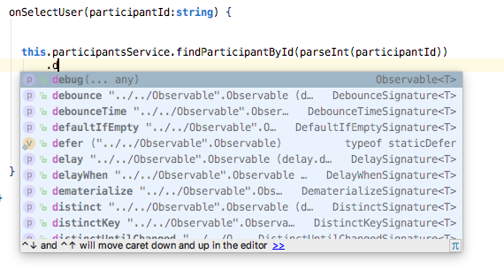

> # [译] RxJS: 如何调式RxJS - 一种调试 RxJS 的 Observable 的简单方法

> 原文链接: [http://blog.angular-university.io/debug-rxjs/](http://blog.angular-university.io/debug-rxjs/)  
 翻译：许盛

我最近使用了这种方法，并且这种方法被证明了非常有用。这是一种在基于 `Angular` 或者其他任何使用了 `Rxjs` 的应用中调试 `Rxjs` 代码非常简单且有效的方法。

也许在未来会出现更为先进的工具来调试 `RxJS` ，但如果你现在在使用 `Angular` 项目，并且希望能有一个让你明白代码中发生了什么，同时保持对代码的良好理解的方法，那么这个方法会对你有所帮助。
 
这个方法被用在生产环境中没有任何问题，它对内存泄露或其他可能导致的问题有很好的防范，就像我们马上会看到的一样。

## RxJS 中的 do 操作符

打日志其实是使用 `do` 操作符实现的一个附带的功能，, 这个操作符可以用来像下面这样调试 `RxJS` 代码。

```javascript
  findParticipantById(participantId: number): Observable<Participant> {
        return this.http.get(`/api/participants/${participantId}`)
            .do( res => console.log('HTTP response:', res))
            .map(res => res.json().payload)
            .do(console.log);
  }
```
需要注意的是如果我们想给这个值加上点什么东西，我们需要使用 `map` 操作符并定义一个函数，但我们只需要简单的传递一个 `console.log` 函数给 `do` 操作符，这个数据链中的值就会被打印出来。

**使用这种方法带来的问题**

使用这种方法的问题是我们没办法在生产环境中关闭打印功能，也许我们会希望总是将值给打印出来，但是这样可能太详细了，如果能只在开发环境中才展示这些信息的话就太好了，就像下面将要说到的那样。

## RxJS 中的 debug 操作符

下面是一个调式 `Angular` 应用中 `RxJS` 代码的例子：

```javascript
onSelectUser(participantId:string) {

  this.participantsService.findParticipantById(parseInt(participantId))
      .debug("Loading participant from backend")
      .subscribe(
          participant => {
              ...
          },
          console.error
      );
}
```

下面是 `console` 中输出的内容：

```
Loading participant from backend Object {id: 1, name: "Alice"}
```

这就是我们在寻找的：在 `console` 中只有一行信息，通过行首的文本来解释上一个可观察对象(Observable)发射的值接下来做了什么（在同一行）

但是 `debug` 操作符并不是 `Observable` 自带的API，所以我们要怎样实现它呢？

## debug 操作符的简单实现

如果我们需要的话，我们可以给 `RxJS` 添加自定义的操作符，同时让自动补全也能生效，来看看究竟怎么做吧。

首先，让我们实现一下 `debug` 操作符：

```javascript
import 'rxjs/add/operator/map';
import 'rxjs/add/operator/mergeMap';
import {Observable} from "rxjs";

const debuggerOn = true;

Observable.prototype.debug = function (message: string) {
    return this.do(
        function (next) {
            if (debuggerOn) {
                console.log(message, next);
            }
        },
        function (err) {
            if (debuggerOn) {
                console.error('ERROR >>> ',message , err);
            }
        },
        function () {
            if (debuggerOn) {
                console.log('Completed.');
            }
        }
    );
};
```

那这里都干了些啥呢？

我们首先在 `Observable` 的原型 `prototype` 上添加了一个新的方法，这意味着我们的应用中所有创建的 `observable` 实例都可以调用这个方法啦。

接下来我们使用 `do` 操作符将这个流的值(value)、错误(error)和完成状态(completion)打印在控制台中，而且所有的这些都只会在 `debuggerOn` 这个变量为 `true` 时才会打印出来。

##  观看详细的使用视频

这个视频中通过一个 `Angular` 应用一步一步的讲解了如何实现这个日志工具。

> 译者注：无法观看说明上网姿势不对，请科学上网。

[https://youtu.be/ZxVN4597RX8](https://youtu.be/ZxVN4597RX8)

## 探索更好的日志工具

我们可以更进一步在这个工具中加入更多的功能，让它更具有可配置性，但是这个简单的调试工具其实已经可以满足大部分情况下的需求了。

有一件事情需要记在心里的是要避免在这个操作符中使用其他的 `Observable` 操作符，这样可能会将 `cold observables` 转变为 `hot observables`，并导致各种预料之外的问题。

> 译者注：关于什么是 `cold observables` 和 `hot observables` ，可以看这篇文章，[https://medium.com/@benlesh/hot-vs-cold-observables-f8094ed53339](https://medium.com/@benlesh/hot-vs-cold-observables-f8094ed53339)

然而这里我们用的是 `Typescript`，而 `debug` 操作符并不在 `RxJS` 的类型定义中，所以这是否意味着我们会遇到一个编译错误？

## 给 Debug 操作符加上类型定义

类型定义是可以进行扩展的，所以我们可以为 `debug` 操作符加上我们自己的类型定义，并将它放在正确的地方。

```typescript
declare module 'rxjs/Observable' {
    interface Observable<T> {
        debug: (...any) => Observable<T>;
    }
}
```

这段代码给 `Observable` 的类型定义中加入了一个叫 `debug` 的新方法，有了这个之后，我们就不会在调用 `debug` 操作符的时候产生编译错误啦，而且代码自动补全也会生效了。



## 防范常见的一些问题

随着我们的程序越来越复杂，如果不输出日志信心的话，我们可能很难去理解应用中众多的 observable chains，在一开始就加上调试信息，并在开发的过程中持续关注 `console` 中输出的信息是个不错的注意。

如果出现了一些奇怪的问题，就像下面这样：

+ 某个应该被清除的订阅实例（subscription），不知道为啥依然处于激活状态（这可能会导致内存泄漏问题）

+ 只希望有一个却出现了多个订阅实例（subscription）

所有上面的这些问题都可以在开发的过程中，通过看打印出来的日志并检验我们对程序运行的理解是否正确来提前检测到和修复。

留个言评个论，说说你们平时都用什么方法来调试 `RxJS` 代码的？
